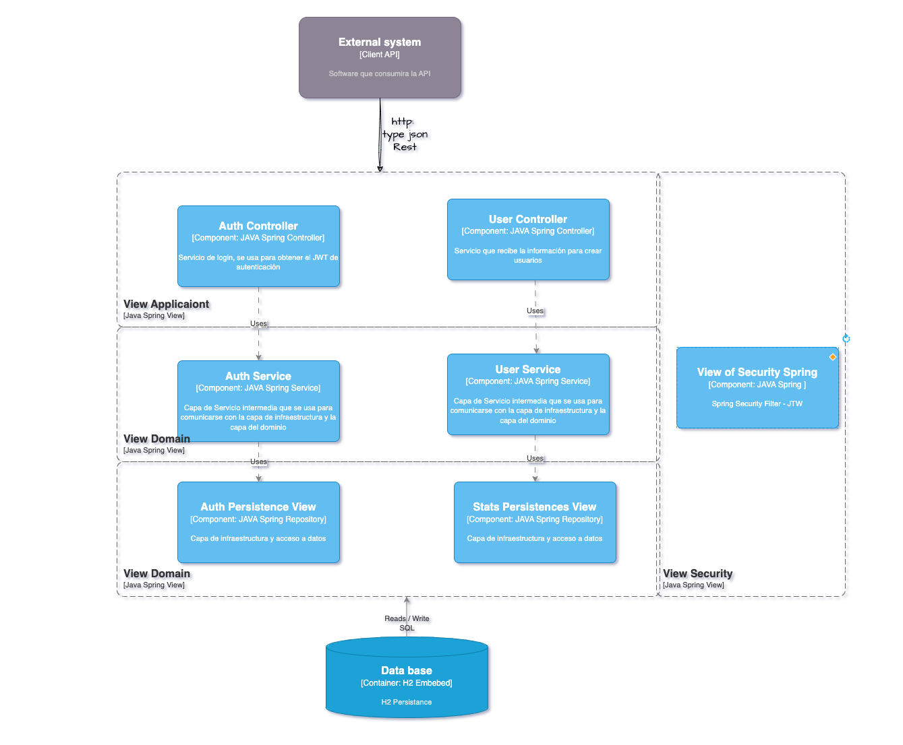

# Documento de diseño

## Índice

- [Solución](#solución)
- [Casos de uso](#casos-de-uso)
- [Solución de arquitectura](#solución-de-arquitectura)
- [Diagrama de clases](#diagrama-de-clases)
- [Base de datos](#base-de-datos)
- [JAVA Dependencies](#java-dependencies)
- [Documentación](#documentación)
- [CI/CD](#ci/cd)
- [Decisiones](#decisiones)

## Solución

Se desarrollara un proyecto tipo Restful API integrando Spring Boot, JPA, PostgreSQL, JWT, Swagger, JUnit, Mockito, Lombok, MapStruct, entre otros.

Teniendo en cuenta que el proyecto debe ser entregado en un plazo de 3 días, se propone el siguiente cronograma:

- Día 1: Diseño de la solución, creación del repositorio, configuración del proyecto, creación de entidades, repositorios, servicios y controladores.
- Día 2: Implementación de pruebas unitarias, integración con base de datos, implementación de JWT, Swagger y pruebas de integración.
- Día 3: Documentación, pruebas finales y entrega.

### Casos de uso

1. Validar Autenticación de peticiones por medio de JWT para todos los endpoints de la api a excepción del endpoint de /login para obtener el token.

2. Existe un endpoint para el registro de usuarios, el cual recibe un usuario con los campos "nombre", "correo", "contraseña", más un listado de objetos "teléfono".

- En caso de éxito, el endpoint de registro retorna el usuario y los siguientes campos:
  - id: id del usuario (puede ser lo que se genera por el banco de datos, pero sería más  deseable un UUID)
  - created: fecha de creación del usuario
  - modified: fecha de la última actualización de usuario
  - last_login: del último ingreso (en caso de nuevo usuario, va a coincidir con la fecha de  creación)
  - token: token de acceso de la API (puede ser UUID o JWT)
  - isactive: Indica si el usuario sigue habilitado dentro del sistema.

3. La api debe tener documentación con Swagger.

### Solución de arquitectura

Se propone la siguiente arquitectura para el desarrollo del proyecto:

- **Capa de aplicación**: Contiene los controladores y los DTOs que se utilizan para la comunicación con el cliente.

- **Capa de dominio**: Contiene las entidades, los repositorios y los servicios que se utilizan para la lógica de negocio.

- **Capa de infraestructura**: Contiene la configuración de la base de datos, la seguridad, el manejo de excepciones y la configuración de Swagger.

- **Capa de pruebas**: Contiene las pruebas unitarias y de integración.

Spring Security para la implementación de JWT.

### Diagrama de clases

Se propone el siguiente diagrama de clases para el desarrollo del proyecto:



### Endpoints - Tabla de contratos

| Endpoint | Metodo | Auth | Body | Response | Status |
|----------|--------|---------|------|----------|--------|
| /auth/login | POST | - | [authCredentialsRequest](#authcredentialsrequest) | [authCredentialsResponse](#authcredentialsresponse) | 200 |
| /user/register | POST | Required | [registerUserResponse](#registeruserrequest) |  [registerUserResponse](#registeruserresponse) | 201 |

#### authCredentialsRequest

```json
    {
        "email": "string",
        "password": "string"
    }
```

#### authCredentialsResponse

```json
    {
        "token": "string"
    }
```

#### registerUserRequest

```json
    {
        "name": "string",
        "email": "string",
        "password": "string",
        "phones": [
            {
                "number": "string",
                "citycode": "string",
                "contrycode": "string"
            }
        ]
    }
```

#### registerUserResponse

```json
    {
        "id": "string",
        "created": "string",
        "modified": "string",
        "last_login": "string,    
        "is_active": boolean
    }
```

## Base de datos

Se propone el siguiente modelo de base de datos para el desarrollo del proyecto:

- **users** Tabla que almacena la información de los usuarios.
  - id: id del usuario. UUID.
  - name: nombre del usuario.
  - email: correo del usuario.
  - password: contraseña del usuario.
  - created: fecha de creación del usuario.
  - modified: fecha de la última actualización del usuario.
  - last_login: fecha del último ingreso del usuario.
  - is_active: indica si el usuario sigue habilitado dentro del sistema.
  - token: token de acceso de la API.
  - phones: listado de teléfonos del usuario.

- **phones** Tabla que almacena la información de los teléfonos de los usuarios.
  - id: id de tipo int.
  - number: número del teléfono.
  - citycode: código de ciudad del teléfono.
  - contrycode: código de país del teléfono.
  - user_id: id del usuario al que pertenece el teléfono.

## JAVA Dependencies

Para Java Spring Boot, se utilizó las siguientes dependencias:

- **Spring Web**
- **Spring Data JPA**
- **H2 Database**
- **Lombok**
- **Swagger**
- **Spring Boot Actuator**
- **Spring Boot DevTools**
- **Spring Boot Test**
- **Spring Boot Starter Test**
- **Mockito**

Para la validación de headers, se utilizó la dependencia:

- **Spring Security**

Para la generación de reportes de cobertura, se utilizó la dependencia:

- **Jacoco**

### Documentación

La documentación de la API se encuentra en Swagger, api_path/swagger-ui.html

### CI/CD

Se utilizó GitHub Actions para la integración continua y despliegue continuo.

### Decisiones

- Se utilizó PostgreSQL como base de datos.
- Se utilizó JWT para la autenticación de los endpoints.
- Se utilizó MapStruct para el mapeo de entidades a DTOs.
- Se utilizó Lombok para la generación de getters, setters, constructores y otros métodos.
- Se utilizó Mockito para la creación de mocks en las pruebas unitarias.
- Se utilizó Jacoco para la generación de reportes de cobertura.
- Se utilizó Spring Security para la validación de los headers de autenticación.
- Se utilizó GitHub Actions para la integración continua y despliegue continuo.
- Se utilizó Swagger para la documentación de la API.
